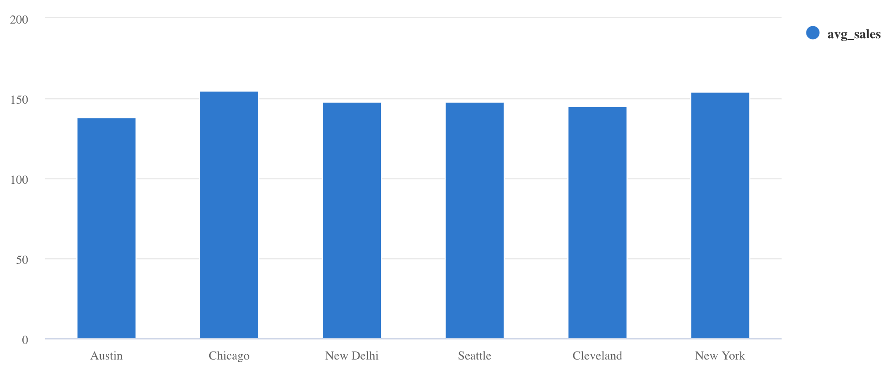
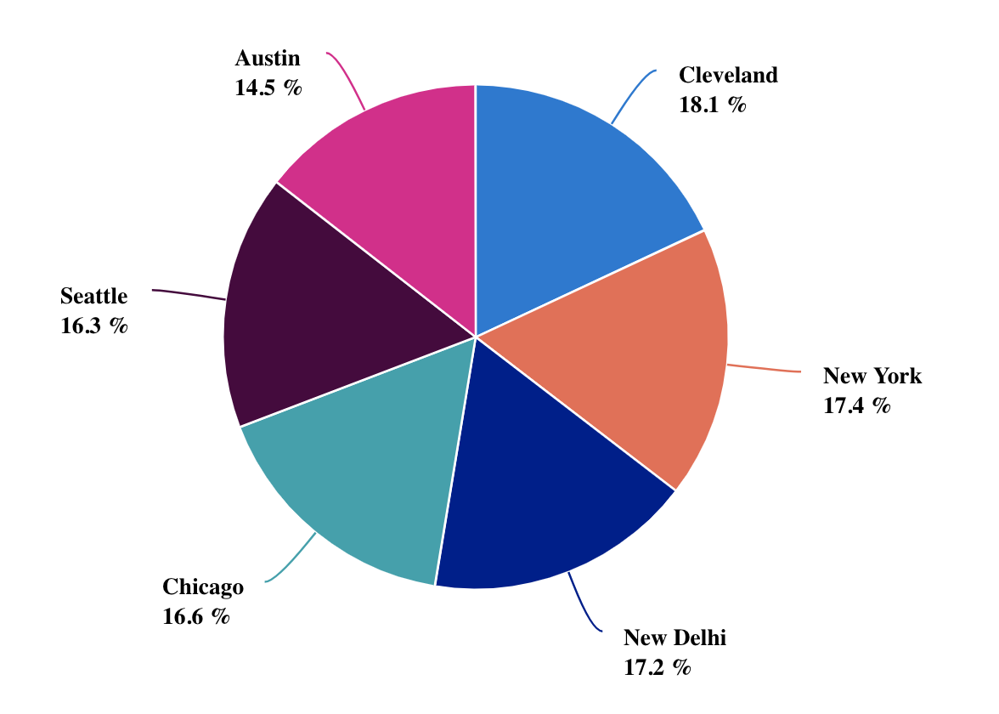
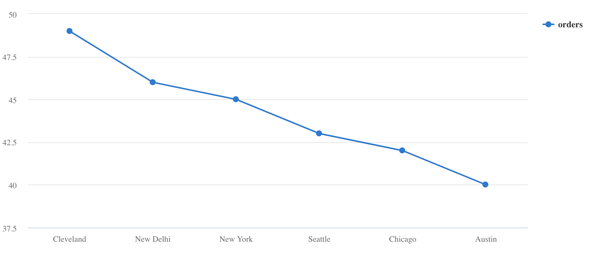

# Change Data Capture from PostgreSQL to Azure Data Explorer using Kafka Connect

This quickstart demonstrates how you can use Change Data Capture to stream database modifications from PostgreSQL to [Azure Data Explorer](https://docs.microsoft.com/en-us/azure/data-explorer/) via [Apache Kafka](https://kafka.apache.org/). It revolves around [Kafka Connect](https://kafka.apache.org/documentation/#connect) which is a platform to build scalable and reliable streaming data pipelines. All the components run in Docker containers - this includes Kafka, Zookeeper, Kafka Connect workers and the event generator application.

## Overview

*Change Data Capture (CDC)* is a technique used to track row-level changes in database tables in response to create, update and delete operations. This is a powerful capability, but useful only if there is a way to tap into these event logs and make it available to other services which depend on that information.

[Debezium](https://debezium.io/) is a distributed platform that builds on top of Change Data Capture features available in different databases. It provides a set of [Kafka Connect connectors](https://debezium.io/documentation/reference/1.2/connectors/index.html) which tap into row-level changes (using CDC) in database table(s) and convert them into event streams that are sent to Apache Kafka. Once the change log events are in Kafka, they will be available to all the downstream applications.

Here is a high-level overview of the scenario. Please note that it has been kept simplified for demonstration purposes.

Data related to `Orders` is stored in a PostgreSQL database and contains information such as order ID, customer ID, city, transaction amount etc. Sample order data is continuously generated with the help of a custom Go application. This data is then picked up by a Kafka Connect source connector and sent to a Kafka topic. Once the data is in Kafka, another (Sink) connector sends them to Azure Data Explorer allow or further querying and analysis.

Here is a gist of the individual components:

**The foundation**

- Apache Kafka - distributed streaming platform
- Kafka Connect - tool for streaming data pipelines driven by source and sink connectors.

**Source and destinations**

- PostgreSQL: RDBMS to store `orders` data
- Azure Data Explorer: fully managed Big Data Analytics platform

**Kafka Connect connectors**

- [Debezium connector for PostgreSQL](https://debezium.io/documentation/reference/1.2/connectors/postgresql.html) - Captures row-level changes a PostgreSQL database and sends them to Kafka
- [Azure Data Explorer sink connector](https://github.com/Azure/kafka-sink-azure-kusto) - Open source connector that pushes data from Kafka into Azure Data Explorer

## Pre-requisites

- You will need a [Microsoft Azure account](https://docs.microsoft.com/azure/). Maybe try a [free one?](https://azure.microsoft.com/free/)
- Install [Azure CLI](https://docs.microsoft.com/cli/azure/install-azure-cli?view=azure-cli-latest) if you don't have it already (should be quick!) or just use the [Azure Cloud Shell](https://azure.microsoft.com/features/cloud-shell/) from your browser.
- [Docker](https://docs.docker.com/get-docker/) and [Docker Compose](https://docs.docker.com/compose/install) installed
- Clone this repo

```shell
git clone https://github.com/abhirockzz/kafka-data-explorer-cdc
cd kafka-data-explorer-cdc
```

## Docker Compose services

All the components in this demo run as Docker containers (except Azure Data Explorer of course) using Docker Compose. You can refer to the [docker-compose file in the repo](docker-compose.yaml): here is a quick overview:

The [debezium](https://hub.docker.com/r/debezium/kafka/) images are used for Kafka and Zookeeper

```yaml
  zookeeper:
    image: debezium/zookeeper:1.2
    ports:
      - 2181:2181
  kafka:
    image: debezium/kafka:1.2
    ports:
      - 9092:9092
    links:
      - zookeeper
    depends_on:
      - zookeeper
    environment:
      - ZOOKEEPER_CONNECT=zookeeper:2181
      - KAFKA_ADVERTISED_LISTENERS=PLAINTEXT://localhost:9092
```

[debezium/example-postgres](https://hub.docker.com/r/debezium/example-postgres) is a handy Docker image for PostgreSQL and the `orders-gen` service is a custom Go application to seed random orders data into PostgreSQL

```yaml
  postgres:
    image: debezium/example-postgres
    ports:
      - "5432:5432"
    environment:
      - POSTGRES_USER=postgres
      - POSTGRES_PASSWORD=postgres
  orders-gen:
    build:
      context: ./orders-generator
    links:
      - postgres
    depends_on:
      - postgres
```

Kafka Connect workers: Both the connectors (source and sink) run within this container. The PostgreSQL connector is built into [debezium/connect](https://hub.docker.com/r/debezium/connect) image and the Azure Data Explorer connector is installed on top of that (you can check this [Dockerfile](connector/Dockerfile))

```yaml
  connect:
    build:
      context: ./connector
      args:
        KUSTO_KAFKA_SINK_VERSION: 1.0.1
    ports:
      - 8083:8083
    links:
      - kafka
      - postgres
    depends_on:
      - kafka
      - postgres
      - orders-gen
    environment:
      - BOOTSTRAP_SERVERS=kafka:9092
      - GROUP_ID=adx
      - CONFIG_STORAGE_TOPIC=my_connect_configs
      - OFFSET_STORAGE_TOPIC=my_connect_offsets
      - STATUS_STORAGE_TOPIC=my_connect_statuses
```

Before we dive into things, let's make sure you have setup and configured Azure Data Explorer

## Setup and configure Azure Data Explorer

1. Create an Azure Data Explorer cluster and a database - you can use this [handy quickstart from the documentation](https://docs.microsoft.com/en-us/azure/data-explorer/create-cluster-database-portal)

2. Create a table (`Orders`) and the mapping (`OrdersEventMapping`) using the [KQL](https://docs.microsoft.com/en-us/azure/data-explorer/kql-quick-reference) below:

```kusto
.create table Orders (orderid: string, custid: string, city: string, amount: int)

.create table Orders ingestion json mapping 'OrdersEventMapping' '[{"column":"orderid","Properties":{"path":"$.orderid"}},{"column":"custid","Properties":{"path":"$.custid"}},{"column":"city","Properties":{"path":"$.city"}},{"column":"amount","Properties":{"path":"$.amount"}}]'
```

(Optional) For the purposes of this demo, update the ingestion batching policy. This will allow records to be ingested quickly:

```kusto
.alter table Orders policy ingestionbatching @'{"MaximumBatchingTimeSpan":"00:00:30", "MaximumNumberOfItems": 500, "MaximumRawDataSizeMB": 1024}'

.show table <enter database name>.Orders policy ingestionbatching
```

3. Create a Service Principal in order for the connector to authenticate and connect to Azure Data Explorer service.

Use `az ad sp create-for-rbac` command:

```
az ad sp create-for-rbac -n "kusto-sp"
```

You will get a JSON response as such - please note down the `appId`, `password` and `tenant` as you will be using them in subsequent steps

```json
{
  "appId": "fe7280c7-5705-4789-b17f-71a472340429",
  "displayName": "kusto-sp",
  "name": "http://kusto-sp",
  "password": "29c719dd-f2b3-46de-b71c-4004fb6116ee",
  "tenant": "42f988bf-86f1-42af-91ab-2d7cd011db42"
}
```

4. Add permissions to your database

Provide appropriate role to the Service principal you just created. To assign the `admin` role, [follow this guide](https://docs.microsoft.com/en-us/azure/data-explorer/manage-database-permissions#manage-permissions-in-the-azure-portal) to use the Azure portal or use the following command in your Data Explorer cluster

```kusto
.add database <database name> admins  ('aadapp=<service principal AppID>;<service prinicpal TenantID>') 'AAD App'
```

Let's dive into some hands-on stuff. In the next few sections, you will:

- Get the environment up and running (all the containers)
- Setup the source (PostgreSQL) and sink (Azure Data Explorer) connectors
- Validate the end to end pipeline

## Start the Docker containers

Since this is based on Docker Compose, starting up the environment is very convenient - just a single command:

```shell
docker-compose --project-name kusto-kafka-cdc up --build
```

This will start Kafka, Zookeeper, Kafka Connect workers, PostgreSQL and a custom events generator application that will start inserting random order events to the `orders_info` table in PostgreSQL. 

> It might take a while to download and start the containers - note that this is just a one time process.

Once the containers have started, to confirm, you can run:

```shell
docker-compose -p kusto-kafka-cdc ps

            Name                          Command              State                          Ports                       
--------------------------------------------------------------------------------------------------------------------------
kusto-kafka-cdc_connect_1      /docker-entrypoint.sh start     Up      0.0.0.0:8083->8083/tcp, 8778/tcp, 9092/tcp,        
                                                                       9779/tcp                                           
kusto-kafka-cdc_kafka_1        /docker-entrypoint.sh start     Up      8778/tcp, 0.0.0.0:9092->9092/tcp, 9779/tcp         
kusto-kafka-cdc_orders-gen_1   /orders-gen                     Up                                                         
kusto-kafka-cdc_postgres_1     docker-entrypoint.sh postgres   Up      0.0.0.0:5432->5432/tcp                             
kusto-kafka-cdc_zookeeper_1    /docker-entrypoint.sh start     Up      0.0.0.0:2181->2181/tcp, 2888/tcp, 3888/tcp,        
                                                                       8778/tcp, 9779/tcp
```

At this point you can also do quick sanity check to confirm that the order information is being persisted. Use a tool of your choice to connect to the PostgreSQL instance (I have used [psql](https://www.postgresql.org/docs/13/app-psql.html) in the example below).

**Enter *postgres* when prompted for a password**

```sql
psql -h localhost -p 5432 -U postgres -W -d postgres

select * from inventory.orders_info order by orderid desc limit 5;

 orderid | custid | amount | city  
---------+--------+--------+-------
      48 |    840 |    140 | city3
      47 |    613 |    132 | city3
      46 |    904 |    124 | city3
      45 |    529 |    118 | city1
      44 |    711 |    187 | city2
(5 rows)
```

> This will give you the five most recent orders.

To stream order information to Kafka, we need to configure and start an instance of the Debezium PostgreSQL source connector.

## Debezium PostgreSQL source connector setup

Copy the JSON contents below to a file (you can name it `pg-source-config.json`).

```json
{
    "name": "pg-orders-source",
    "config": {
        "connector.class": "io.debezium.connector.postgresql.PostgresConnector",
        "database.hostname": "postgres",
        "database.port": "5432",
        "database.user": "postgres",
        "database.password": "postgres",
        "database.dbname": "postgres",
        "database.server.name": "myserver",
        "plugin.name": "wal2json",
        "table.whitelist": "inventory.orders_info",
        "value.converter": "org.apache.kafka.connect.json.JsonConverter"
    }
}
```

To start the connector, simply use the Kafka Connect REST endpoint to submit the configuration.

```shell
curl -X POST -H "Content-Type: application/json" --data @pg-source-config.json http://localhost:8083/connectors

# to confirm
curl http://localhost:8083/connectors/pg-orders-source
```

Let's peek into the Kafka topic and take a look at the change data capture events produced by the source connector.

```shell
docker exec -it kusto-kafka-cdc_kafka_1 bash
```

You will be dropped into a shell (inside the container):

```
cd bin && ./kafka-console-consumer.sh --topic myserver.inventory.orders_info --bootstrap-server kafka:9092 --from-beginning
```

Each event in topic is corresponding to a specific order. It is in a JSON format that looks like what's depicted below. Please note that the payload also contains the entire schema which has been removed for brevity.

```json
{
    "schema": {....},
    "payload": {
        "before": null,
        "after": {
            "orderid": 51,
            "custid": 306,
            "amount": 183,
            "city": "city1"
        },
        "source": {
            "version": "1.2.1.Final",
            "connector": "postgresql",
            "name": "myserver",
            "ts_ms": 1602057392691,
            "snapshot": "false",
            "db": "postgres",
            "schema": "inventory",
            "table": "orders_info",
            "txId": 653,
            "lsn": 34220200,
            "xmin": null
        },
        "op": "c",
        "ts_ms": 1602057392818,
        "transaction": null
    }
}
```

## Azure Data Explorer sink connector setup

We have the change-data flowing into Kafka from PostgreSQL. It's time to bring that into Azure Data Explorer using its Kafka sink connector.

Copy the JSON contents below to a file (you can name it `adx-sink-config.json`). Replace the values for the following attributes as per your Azure Data Explorer setup - `aad.auth.authority`, `aad.auth.appid`, `aad.auth.appkey`, `kusto.tables.topics.mapping` (the database name) and `kusto.url`

```json
{
    "name": "adx-orders-sink",
    "config": {
        "connector.class": "com.microsoft.azure.kusto.kafka.connect.sink.KustoSinkConnector",
        "flush.size.bytes": 10000,
        "flush.interval.ms": 30000,
        "tasks.max": 2,
        "topics": "myserver.inventory.orders_info",
        "kusto.tables.topics.mapping": "[{'topic': 'myserver.inventory.orders_info','db': '<enter database name>', 'table': 'Orders','format': 'json', 'mapping':'OrdersEventMapping'}]",
        "aad.auth.authority": "<enter tenant ID from service principal info>",
        "kusto.url": "https://ingest-<enter cluster name>.<enter region>.kusto.windows.net",
        "aad.auth.appid": "<enter app ID from service principal info>",
        "aad.auth.appkey": "<enter password from service principal info>",
        "key.converter": "org.apache.kafka.connect.storage.StringConverter",
        "transforms": "unwrap",
        "transforms.unwrap.type": "io.debezium.transforms.ExtractNewRecordState"
    }
}
```

Notice the part in the config where we used Kafka Connect [Single Message Transformation](https://kafka.apache.org/documentation/#connect_transforms) (SMT) - specifically this is the `ExtractNewRecordState` that debezium provides. You can read up on it [in the documentation](https://debezium.io/documentation/reference/1.2/configuration/event-flattening.html)

```json
"transforms": "unwrap",
"transforms.unwrap.type": "io.debezium.transforms.ExtractNewRecordState"
```

It removes the schema from the JSON payload and strips down the data to only what's required. In this case, all we are looking for the order info from the `after` attribute (in the payload). For e.g.

```json
{
    "orderid": 51,
    "custid": 306,
    "amount": 183,
    "city": "city1"
}
```

Thus, only the relevant data sent to Azure Data Explorer. Also the Kafka topic contains the entire change data event (along with the schema) which can be leveraged by any downstream service!

To install the connector, just use the Kafka Connect REST endpoint like before:

```shell
curl -X POST -H "Content-Type: application/json" --data @adx-sink-config.json http://localhost:8083/connectors

# check status
curl http://localhost:8083/connectors/adx-orders-sink/status
```

The connector should spin into action, authenticate to Azure Data Explorer and start batching ingestion processes.

> Note that `flush.size.bytes` and `flush.interval.ms` are used to regulate the batching process. Please refer to the [connector documentation](https://github.com/Azure/kafka-sink-azure-kusto/blob/master/README.md#5-sink-properties) for details on the individual properties.

Since the flush configuration for the connector and the batching policy for the `Orders` table in Azure Data Explorer is pretty aggressive (for demonstration purposes), you should see data flowing into Data Explorer quickly.

## Query Data Explorer

You can query the Orders table in Data Explorer to slice and dice the data. Here are a few simple queries you could try.

Find out the average sales per city and represent that as a column chart:

```kusto
Orders
| summarize avg_sales = avg(amount) by city 
| render columnchart
```



The total purchase amount per city, represented as a pie chart:

```kusto
Orders 
| summarize total = sum(amount) by city 
| sort by total
| render piechart 
```




Number of orders per city, represented as a line chart:

```kusto
Orders
| summarize orders = count() by city
| sort by orders
| render linechart   
```



## Clean up

To stop the containers, you can:

```shell
docker-compose -p kusto-kafka-cdc down -v
```

To delete the Azure Data Explorer cluster/database, use [az cluster delete](https://docs.microsoft.com/cli/azure/kusto/cluster?view=azure-cli-latest#az-kusto-cluster-delete) or [az kusto database delete](https://docs.microsoft.com/cli/azure/kusto/database?view=azure-cli-latest#az-kusto-database-delete)

```azurecli
az kusto cluster delete -n <cluster name> -g <resource group name>
az kusto database delete -n <database name> --cluster-name <cluster name> -g <resource group name>
```

## Other resources

- [Data Ingestion overview](https://docs.microsoft.com/en-us/azure/data-explorer/ingest-data-overview)
- Explore [what you can do with KQL](https://docs.microsoft.com/en-us/azure/data-explorer/kusto/query/samples)
- [Visualize data with Azure Data Explorer dashboards](https://docs.microsoft.com/en-us/azure/data-explorer/azure-data-explorer-dashboards)
- [Data Explorer connector features](https://github.com/Azure/kafka-sink-azure-kusto/blob/master/README.md#3-features-supported)
- [Debezium connectors](https://debezium.io/documentation/reference/1.2/connectors/index.html)